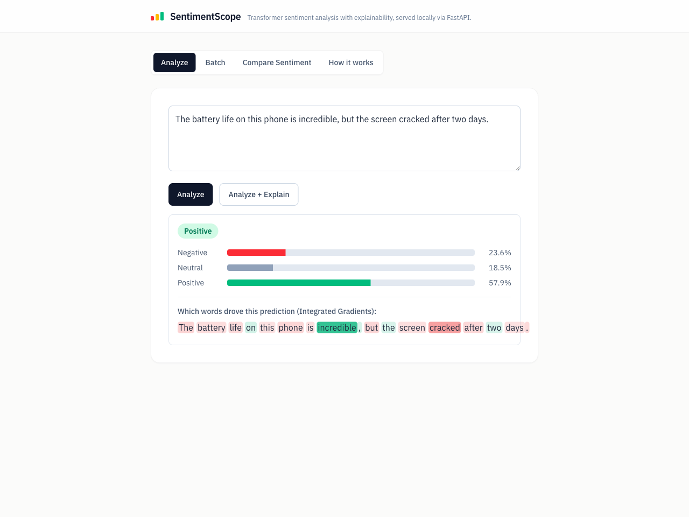
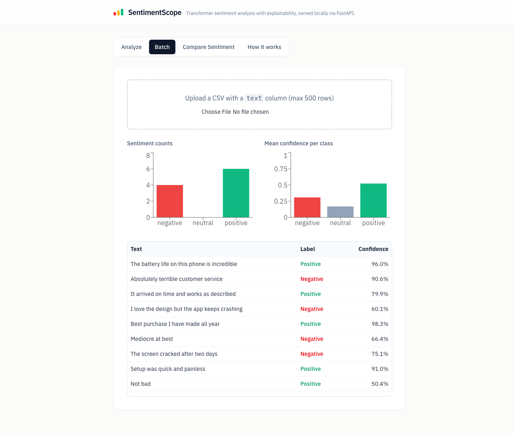
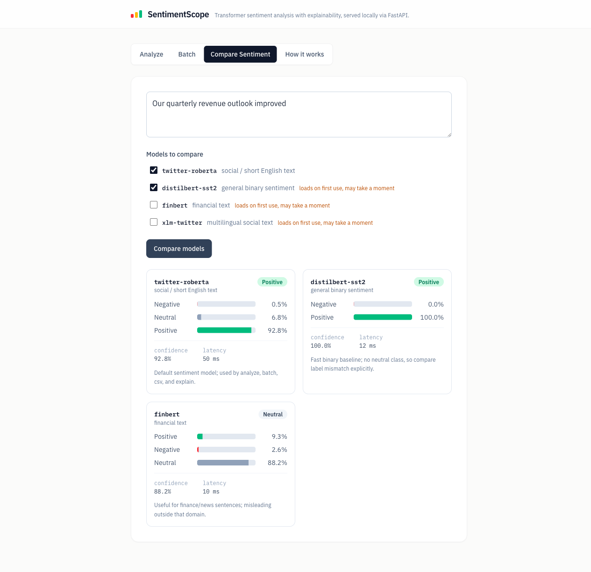

# SentimentScope

**[▶ Live demo — melkholy-sentiment-scope.hf.space](https://melkholy-sentiment-scope.hf.space)** · [Hugging Face Space](https://huggingface.co/spaces/melkholy/sentiment-scope)

An educational, end-to-end ML engineering app: a React UI talking to a FastAPI
backend that serves transformer sentiment models locally — with token-level
**Integrated Gradients explainability**, model comparison, evaluation metrics,
error analysis, batch CSV analysis, tests, Docker, and CI.

Built as an AI/ML portfolio project: the code is deliberately over-commented,
teaching the *why* of each step (tokenization → logits → softmax, GPU batching,
IG attribution) alongside the *what*.



## Architecture

The frontend only ever calls **relative `/api/*` paths**, so the exact same build
runs unchanged across three serving topologies — the interesting engineering trick
that keeps dev, Docker, and the single-container Space in sync.

```
React (Vite + TypeScript + Tailwind v4 + Recharts, React 19 idioms)
        │  relative /api/* calls  (never a hardcoded host)
        ▼
 ┌──────────────────── three serving topologies ────────────────────┐
 │  dev      →  Vite dev server proxies /api → uvicorn               │
 │  compose  →  nginx serves the built SPA, proxies /api → backend   │
 │  Spaces   →  FastAPI serves the SPA itself via StaticFiles        │
 └───────────────────────────────────────────────────────────────────┘
        ▼
FastAPI ── lifespan loads the default SentimentModel (twitter-roberta) ONCE
        ├── analyze / batch / csv / explain : default model only, strict 3-class
        ├── compare()  : lazy-loads sentiment registry models, dynamic label scores
        └── explain()  : captum LayerIntegratedGradients on roberta.embeddings
        ▼
Model registry (task-aware): sentiment (RoBERTa · DistilBERT-SST2 · FinBERT · XLM-R)
                             + AI-detector configs already scaffolded for Phase 2
```

| Endpoint | Purpose |
|---|---|
| `POST /api/analyze` | Single text → label + class probabilities (**twitter-roberta only**, strict 3-class) |
| `POST /api/analyze/batch` | JSON list (≤500) → per-row results + aggregates (**twitter-roberta only**) |
| `POST /api/analyze/csv` | CSV upload (`text` column, ≤5MB, ≤500 non-empty rows) → same shape as batch |
| `POST /api/explain` | Integrated Gradients token attributions (**twitter-roberta only**) |
| `GET /api/models?task=` | Task-aware model registry catalog with a live `loaded` flag |
| `POST /api/compare` | Sentiment-only side-by-side comparison — per-model dynamic scores + wall-clock latency |
| `GET /api/health` · `GET /api/model` | Readiness (`model_loaded`, device) · default model card |

## Quickstart

### Live demo

The app is deployed to a free CPU **[Hugging Face Space](https://melkholy-sentiment-scope.hf.space)** —
no setup required. Because it is a public, shared box the deployment is intentionally
constrained:

- **Two models only.** `ENABLED_MODELS` allowlists `twitter-roberta` + `distilbert-sst2`;
  requesting any other registry model on Compare returns **403** (run locally for the full registry).
- **Rate limited.** One shared **30 requests/minute per IP** budget across all `/api/*`
  routes; bursting past it returns **429**. This mainly protects `/api/explain`, which runs
  ~50 forward passes per call.
- **Weights baked into the image**, so cold starts never re-download — see `Dockerfile.spaces`.

### Docker (one command)

```bash
docker compose up --build
# → http://localhost:8080
```

> **First run downloads ~500MB of model weights** into a persistent `hf-cache` volume.
> There is no container healthcheck, so on a cold cache the frontend returns **502s for
> ~6 minutes** while the backend downloads and loads the model. Subsequent runs reuse the
> volume and come up in seconds. `GET /api/health` flips to `{"model_loaded": true}` once
> inference is ready. (Known Phase-1 gap: no healthcheck/readiness gate — see Roadmap.)

### Local dev

```bash
# Backend — any env with torch + transformers + captum + fastapi
cd backend && pip install -r requirements.txt
uvicorn app.main:app --reload --port 8000

# Frontend
cd frontend && npm install && npm run dev
# → http://localhost:5173 (Vite proxies /api to :8000)
```

Try it: upload `sample-data/reviews.csv` on the **Batch** tab, then run **Compare
Sentiment** on a finance-style sentence (e.g. *"Our quarterly revenue outlook improved"*)
to watch a social model, a binary SST-2 model, and FinBERT disagree.

## Screenshots

| Batch — aggregate charts + per-row table | Compare Sentiment — domain & label mismatch |
|---|---|
|  |  |

The Compare screenshot is the teaching moment: on *"Our quarterly revenue outlook improved"*,
the social **twitter-roberta** says *positive* (92.8%), binary **distilbert-sst2** says
*positive* (100%, with **no neutral class** — a label-space mismatch), and finance-tuned
**finbert** says *neutral* (88.2%, reading it as routine reporting — a domain mismatch).
Same sentence, three defensible-but-different answers.

The **[How it works](docs/screenshots/how-it-works.png)** tab walks through the pipeline in
plain language for non-ML readers.

## Evaluation

`evals/run_eval.py` scores the default model on a deliberately tricky 36-example set
(`evals/data/sentiment_eval.csv`) that concentrates sarcasm, mixed sentiment, and ambiguity —
the cases sentiment models fail on. Full report: [`evals/report.md`](evals/report.md).

| Metric | Value |
|---|---|
| Accuracy | **0.694** |
| Macro F1 | **0.689** |
| Latency p50 / p95 | 6.4 ms / 27.0 ms |

Macro F1 sits below accuracy because the model handles the three classes unevenly — the
number that exposes class imbalance rather than hiding it.

**Confusion matrix** (rows = true, columns = predicted; the diagonal is correct):

| true \ pred | negative | neutral | positive |
|---|---|---|---|
| **negative** | 9 | 1 | 4 |
| **neutral** | 2 | 6 | 3 |
| **positive** | 0 | 1 | 10 |

The off-diagonal tells the story: the model over-predicts *positive* (recall 0.91, precision
0.59) and misses negatives and neutrals — exactly the sarcasm ("Yeah, amazing, another crash")
and mixed-sentiment ("great camera though the battery drains too fast") rows in the report.

## Tests

```bash
cd backend && pytest              # 58 unit tests — model mocked, runs anywhere (no torch)
cd backend && pytest -m integration   # 6 real-model tests across the sentiment registry (needs weights)
cd frontend && npm test -- --run  # 17 component/API tests (vitest + Testing Library)
```

CI (GitHub Actions) runs lint + unit tests + the frontend build on every push —
**without installing torch**, because the heavy imports are lazy and the unit tests inject
a fake model via FastAPI dependency overrides.

## What this project demonstrates

- **ML fundamentals in code:** raw `AutoModelForSequenceClassification` inference (no
  `pipeline()` magic) — tokenization, batching, softmax, and device placement are all explicit
  and explained. Uses Apple-Silicon MPS when available, CPU otherwise.
- **Explainability:** Layer Integrated Gradients with a padding baseline; the UI renders
  per-token attributions as a heatmap. **RoBERTa only** — other registry models are compare-only.
- **Model comparison:** one input across social, binary SST-2, finance, and multilingual
  sentiment models to expose domain/label mismatch and latency tradeoffs (`/api/compare` is
  sentiment-only; each row carries the model's *own* label keys, so a binary model never fakes
  a neutral score).
- **Evaluation:** `evals/run_eval.py` reports accuracy, macro F1, confusion matrix, p50/p95
  latency, and the specific misclassified examples — with a machine-readable JSON summary.
- **Engineering hygiene:** validation at the boundary, a dependency-injected model for
  testability, an integration/unit test split, a CPU-only Docker build, and CI with no GPU deps.

## Engineering decisions

- **Torch-free CI via mocking.** `app/model.py` imports torch lazily and the unit suite sets
  `SKIP_MODEL_LOAD=1`, then overrides the `get_model` dependency with a `FakeModel`. CI installs
  `requirements-dev.txt` (no torch/transformers/captum) and still exercises every route, so the
  pipeline stays fast and free. Real weights are only touched by `pytest -m integration`, run locally.
- **Lazy, memoized, task-aware registry.** The default model loads once at startup; other models
  load on first `/api/compare` use behind per-model locks and are cached, so concurrent requests
  never double-load ~500MB of weights. `resolve_model_source` prefers local `models/` weights and
  falls back to the Hub, so a fresh clone / CI / Docker build works without the untracked weights.
- **Validation at the boundary.** Pydantic caps text length and batch size; CSV upload enforces
  size (413), encoding, a required `text` column, and the row cap — each failure returns a specific
  reason. Routes stay thin: validation in schemas, ML in `SentimentModel`, wiring in between.
- **Strict-3-class contract.** `analyze`/`batch`/`csv`/`explain` reject a non-default `model_id`
  (400) so a 2-class model's output can never silently break the 3-class response schema; polyglot
  scoring is confined to `/api/compare`.
- **Public-deploy guardrails.** A single global rate limiter (not per-route decorators, which would
  force the slowapi import into CI) keyed on the trusted rightmost `X-Forwarded-For` hop, plus an
  `ENABLED_MODELS` allowlist — both off by default in dev.

## Honest limitations

- The default model was trained on tweets: long/formal text is out-of-domain.
- Explainability (Integrated Gradients) is implemented for the default Twitter RoBERTa model only;
  DistilBERT/FinBERT/XLM-R are available via `/api/compare` only.
- Sentiment models are not creativity judges; they estimate polarity, confidence, and disagreement.
- 512-token truncation; sarcasm, mixed sentiment, and missing context remain hard (see the eval).
- IG uses 50 integration steps — a principled approximation, not ground truth.
- The public Space is CPU-only, rate-limited (30 req/min), and serves two models; clone and run
  locally for the full registry and unthrottled use.

## Roadmap

- **Phase 2 — AI text detection.** Local detector models (desklib / fakespot / oxidane) served
  through dedicated endpoints with detector-disagreement reporting and uncertainty warnings, plus
  an AI Detector tab. The task-aware registry already carries the detector configs; the serving
  endpoints and UI ship next.
- **Docker healthcheck / readiness gate** so the compose frontend waits for model load instead of
  returning cold-start 502s.

## Repository layout

```
backend/     FastAPI app (routes, schemas, model, task-aware registry) + unit/integration tests
frontend/    React 19 + Vite + Tailwind v4 SPA (Analyze / Batch / Compare / How it works)
evals/       Sentiment evaluation harness + committed report
sample-data/ reviews.csv for the Batch tab demo
docs/        Screenshots
docker-compose.yml · Dockerfile.spaces   Compose (nginx + backend) and single-image Space builds
```
